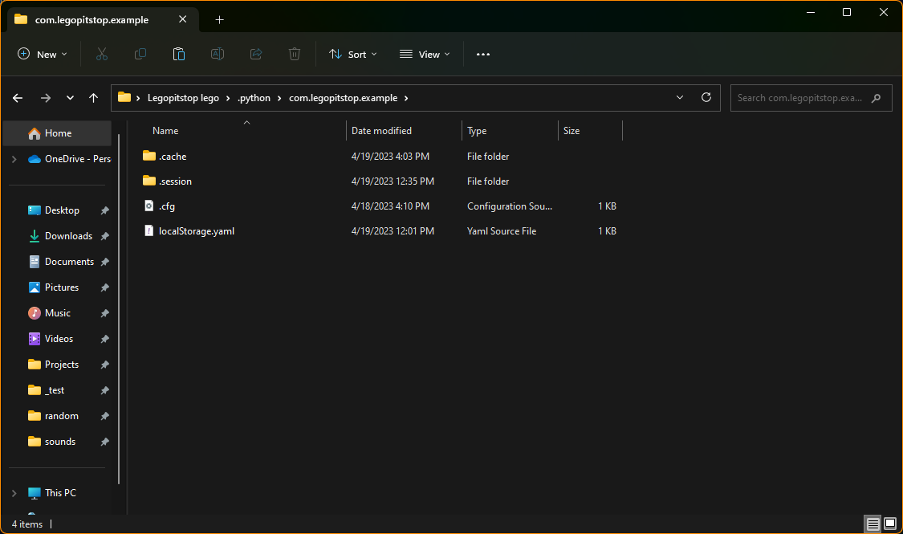

# UserFolder - 1.0.2
## What is this
This is a simple library that allows you to read, write and create files within your own folder inside the user folder (`C:/User/[ name ]/.python/[ id ]`)

## Features
- Automaticlly creates the directory.
- Read and write to files inside the User folder.
- Includes an uninstall function which will delete all files inside your direcotry.
- A function to open the directory or open the file that is inside the directory.

## Install
`pip install UserFolder`

## Examples

Creates the folder `com.legopitstop.example` inside the user folder.
```python
from UserFolder import User

USER = User('com.legopitstop.example') # Create folder
USER.show() # Show the folder
```


Write to `config.json`
```python
from UserFolder import User
import json

USER = User('com.legopitstop.example') # Create folder

# Create config file
default = {'value': 'Hello World!'}
create = USER.open('config.json','w') # Open file in write mode
create.write(json.dumps(default)) # convert dict to TextIOWrapper then write
create.close() # close the file
USER.show() # Show the folder
```


Read the contents of the created config.json file

```python
from UserFolder import User
import json

USER = User('com.legopitstop.example') # Create folder

# Read config file if it exists
if USER.exists('config.json'): # Returns True if it exists, False if does not exists
    opn = USER.open('config.json','r') # opem file in read mmode
    out = json.loads(opn.read()) # convert TextIOWrapper to dict
    print(out['value']) # the the `value` dict from the file
    opn.close() # close the file
else:
    print('Failed to find config, Mabe I should create one?')

>> Hello World!
```

Get all files inside the user folder
```python
from UserFolder import User

USER = User('com.legopitstop.example') # Create folder

out = USER.list() # Get all files inside the user folder
print(out)

>> ['config.json']
```

Get the full url of the user folder
```python
from UserFolder import User

USER = User('com.legopitstop.example') # Create folder

out = USER.get()
print(out)

>> 'C\Users\[ User ]\/python\com.legopitstop.example\'
```

Uninstall all files that the script uses.
```python
from UserFolder import User

USER = User('com.legopitstop.example') # Create folder
confirm = input('This will delete all data for this app, do you want to continue? (Y/N) :') # confirm input
if confirm.lower()=='y':
    print('uninstalling...')
    err = USER.uninstall() # Delete all files and the directory. returns False if it failed to uninstall
    if err==True:
        print('uninstalled')
    else:
        print('Could not uninstall, make sure all files are closed.')

>> This will delete all data for this app, do you want to continue? (Y/N :y
>> uninstalling...
>> uninstalled
```

## License
MIT License